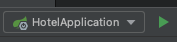

# Selmefy Hotel Backend
### IT0302: TalTech Full-Stack web project

---

- [How To run backend application](#how-to-run-backend-application)
- [Spring Security with JWT](#spring-security-with-jwt)
  - [Basic Auth](#basic-auth) 
  - [Auth with JWT](#auth-with-jwt)
  - [How to implement security](#how-to-implement-security)
    - [Step 1: Configuration class](#step-1-configuration-class)
    - [Step 2: Security Filter Chain](#step-2-security-filter-chain)
    - [Step 3: Stuff for JWT](#step-3-stuff-for-jwt)

---

# How To run backend application

_Remember that you should have Java 17 or Docker_

There is two approach to run backend application.

- First approach what is usually we use when we develop is backend locally and database is in docker container. 
Before to run backend app, you should run Postgresql DB. You can do this through the docker-compose.yml file. <br>
In this file click to button 'play' near the `hotel_db` and when postgresql db is running, then you can run backend app.  
 <br>
To run backend app you have some options. First option is through the Main class and second is using 'Select Run/Debug Application'.
Go to the `HotelApplication` class and there click to 'play' button. <br>
 <br>
OR in top bar <br>


- Second is all in docker containers. <br>
If you choosed this approach, then you should go to the docker-compose.yml file and click to button 'play'. <br>


OR write in terminal `docker-compose up -d` then all services will be run in docker containers.

---

# Spring Security with JWT


_Written by Aleksandr Trofimov_

Material: https://www.bezkoder.com/spring-boot-jwt-authentication/ <br>
Didn't see, but I will check it in close future:
https://www.bezkoder.com/spring-boot-refresh-token-jwt/

_NB!_ In our project we use these three spring security dependencies (Core, Web, Config):
> 1. https://mvnrepository.com/artifact/org.springframework.security/spring-security-core
> 2. https://mvnrepository.com/artifact/org.springframework.security/spring-security-web
> 3. https://mvnrepository.com/artifact/org.springframework.security/spring-security-config

## Basic Auth


## Auth with JWT


_This is my imagine, how I see it._

## How to implement security
If we have already added a spring security to gradle/maven dependencies, then it should work without any configuration, since Spring Security have own default configurations.

To check it, just run your application and go to the some endpoint in browser or Postman, then it should return a login form.


To login into this form - use next credentials: <br>
**username**: user <br>
**password**: _check in console logs_ ("Using generated security password:") 

### Step 1: Configuration class
For custom configuration, we should create the Spring Security config class.
No matter where you will create this class, but in best practises - better to create security package for separate.
In our project I named this class as WebSecurityConfig. <br>
E.g. `src/main/<project>/security/config/WebSecurityConfig`

This configuration class we should annotate with `@EnableWebSecurity`, then Spring know, that this class is for security configuration.
And also we can annotate with `@Configuration`.

### Step 2: Security Filter Chain
The first thing, that Spring look for, is a Bean of type security filter chain.
So we should implement it in our config class.

```
@Bean
public SecurityFilterChain filterChain(HttpSecurity http) throws Exception {

    http.csrf().disable()
        .exceptionHandling().authenticationEntryPoint(unauthorizedHandler).and()
        .sessionManagement().sessionCreationPolicy(SessionCreationPolicy.STATELESS).and()
        .authorizeRequests().antMatchers("/auth/**").permitAll()
        .anyRequest().authenticated();

    http.authenticationProvider(authenticationProvider());

    http.addFilterBefore(authenticationJwtTokenFilter(), UsernamePasswordAuthenticationFilter.class);

    return http.build();
```

> CSRF (Cross Site Request Forgery) - is a web security vulnerability that allows an attacker to induce users to perform actions that they do not intend to perform. It allows an attacker to partly circumvent the same origin policy, which is designed to prevent different websites from interfering with each other.

In our project I disable csrf, because we use JWT token.
If we are using JWT based token mechanism, we don’t need CSRF protection and we must disable.

`.exceptionHandling().authenticationEntryPoint(unauthorizedHandler)` is for throwing unauthorized exception which come from AuthEntryPoint.class.

`.sessionManagement().sessionCreationPolicy(SessionCreationPolicy.STATELESS)`
After a user logs in, the web application has to persist the authentication data over server requests, so that the user isn’t asked to log in again for every single action. 
Stateless authentication presents a way to persist the authentication data on the client side between requests.
Unlike server-side authentication storage solutions, which commonly rely on sessions, stateless authentication doesn’t require you to keep track of sessions on the server.

`.antMatchers("/auth/**)`
The antMatchers() method is an overloaded method that receives both the HTTP request methods and the specific URLs as its arguments. <br>

`.authentiocationProvider(authenticationProvider())` this method uses argument 'extractor' DaoAuthenticationProvider for retrieves the user details from a read-only user DAO - UserDetailsService.

```
@Bean
public DaoAuthenticationProvider authenticationProvider() {
    DaoAuthenticationProvider authProvider = new DaoAuthenticationProvider();

    authProvider.setUserDetailsService(userAccountService);
    authProvider.setPasswordEncoder(passwordEncoder());

    return authProvider;
}   
```

`.setUserDetailsService(userAccountService)` - provide service for extract UserAccount data

`.setPasswordEncoder(passwordEncoder())` - provide encoder, which will encode the user's password.

### Step 3: Stuff for JWT

#### Here I will write in few sentences, what we have for work with JWT:
1. JwtUserDetails which implements UserDetails
2. AuthEntryPointJwt which implements AuthenticationEntryPoint
3. AuthTokenFilter which extends OncePerRequestFilter 
4. JwtTokenUtil

> Spring.io : <br>
> - UserDetails is returned by the UserDetailsService. The DaoAuthenticationProvider validates the UserDetails and then returns an Authentication that has a principal that is the UserDetails returned by the configured UserDetailsService. <br>
> - UserDetailsService is used by DaoAuthenticationProvider for retrieving a username, a password, and other attributes for authenticating with a username and password. Spring Security provides in-memory and JDBC implementations of UserDetailsService.

AuthEntryPointJwt is Exception Handler, which will be triggered anytime unauthenticated User requests a secured HTTP resource and an AuthenticationException is thrown.

AuthTokenFilter, where OncePerRequestFilter is base class that aims to guarantee a single execution per request dispatch, on any servlet container. 

JwtTokenUtil is util with validate or generate jwt token.